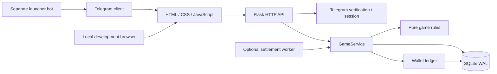

# Архитектура

## Решение для первого запуска

Приложение — модульный монолит: один HTTP-сервис, одна база, отдельный необязательный Telegram launcher и необязательный worker завершения боёв. Такой размер позволяет быстро менять правила и интерфейс, сохраняя одну транзакционную границу для денег, матчмейкинга и результатов.

Текущая реализация рассчитана на **один хост и локальную SQLite**. Несколько Gunicorn workers на этом хосте используют общую базу. Это не горизонтальное масштабирование: запись SQLite сериализована, а несколько независимых экземпляров базы разделили бы игроков и балансы. Целевое количество одновременных игроков пока не измерено нагрузочным тестом.



## Границы модулей

| Модуль | Отвечает за | Не должен знать |
| --- | --- | --- |
| `rules.py` | Каталог, цены, сила, шанс, награды, версию правил | HTTP, Telegram, SQL |
| `wallet.py` | Единственный путь изменения `balance_minor` и запись в `coin_ledger` | Кнопки интерфейса и Bot API |
| `service.py` | Игровые команды, инварианты, транзакции, подбор и расчёт боя | DOM и детали доставки Telegram |
| `storage.py` | SQLite connection, миграции, транзакции и их backfill | HTTP и интерфейс |
| `auth.py` | Проверку подписи Telegram и сроков сессии | Награды и экипировку |
| HTTP factory | JSON, ошибки, аутентификацию, вызов сервиса | Собственные расчёты цены и победы |
| `web/` | Анимации, отображение серверного состояния, агрегацию кликов | Истину о балансе, времени и результате |
| `scripts/bot.py` | Команды `/start`, `/play`, `/help`, кнопку Mini App | Игровые балансы и результаты |

Правила остаются чистыми функциями. Прямой SQL сейчас находится в сервисе и слое хранения: выделять универсальные репозитории заранее не требуется. Когда понадобится PostgreSQL, интерфейсы репозиториев стоит выделить вокруг существующих сценариев и проверить теми же контрактными тестами.

## Команда и транзакция

Клиент передаёт намерение — например, улучшить `sword` или начать бой с ботом. Он выбирает ставку из разрешённого списка и передаёт `expected_power` для проверки устаревшего экрана; сервис самостоятельно вычисляет мощь и приз. Для каждой изменяющей команды нужен уникальный `Idempotency-Key`; повтор после потери ответа использует прежний ключ и тот же JSON.

1. HTTP проверяет сессию и формат запроса.
2. Сервис открывает транзакцию `BEGIN IMMEDIATE` и проверяет идемпотентность.
3. Внутри транзакции проверяются ограничения, списывается валюта, записываются результат и `coin_ledger`.
4. Успешный результат команды сохраняется вместе с её идентификатором.
5. После commit клиент получает состояние сервера.

Повтор одной команды не списывает валюту дважды. Повтор ключа с другим содержимым отвергается. Ошибка откатывает всю транзакцию; состояния «ставка списалась, бой не создан» быть не должно. Деньги хранятся в целых сотых долях монеты. Дробные вероятности и котировка приза рассчитываются через `Fraction`; только финальный шанс для SQL/JSON преобразуется в `float`. Цены и награды никогда не берутся из браузера.

`GET /state` также может завершить просроченный бой в транзакции. Это осознанное свойство MVP: состояние восстановится даже без постоянно работающего worker. `roosters.worker` использует тот же сервис завершения; два конкурентных завершения не должны повторно выдавать награду.

Пригласивший получает 300 монет при регистрации нового Telegram-пользователя
с подтверждённым `start_param`: создание аккаунта, приветственная награда друга
и запись `referral_signup` в `coin_ledger` коммитятся вместе. Ещё 300 начисляются
пригласившему в транзакции третьего завершённого боя друга (`players.battles`),
включая бесплатный и любой исход. Обе записи ссылаются на ID друга; уникальность
`(player_id, reason, reference)` и `referral_paid` защищают от повторов.
Флаг ранее выплаченных наград сохраняется; существующий аккаунт не может
перепривязать приглашение или получить начисление первого входа задним числом.

`state.reward_events` читает последние 20 записей `coin_ledger` текущего игрока
с причинами `referral_signup`, `referral`, `battle_reward`. Журнал под
приглашениями показывает реальные суммы, время и имя друга; повторные запросы
читают те же ID и не создают новые записи. Нулевая выплата проигранного боя
также видна, списание ставки и другие источники дохода сюда не входят.
Миграция `006_reward_events.sql` добавляет индекс `(player_id,id DESC)` для
выборки последних событий; существующие балансы и записи остаются прежними.

## Бой и случайность

При создании боя фиксируются участники, сила, порода, версия правил, срок окончания и серверная случайность. Пока игрок в очереди или в активном бою, менять экипировку и породу нельзя. Балансировка каталога между запросами не должна менять уже начатый бой; прежние движки правил нужно сохранять в реестре до завершения их матчей.

Текущая версия v8: 2 секунды подготовки/рулетки, 10 секунд боя, до 90
касаний без ограничения скорости и без выбора стоек. При создании сохраняются
`stake_minor`, начальный `win_payout_minor` стороны A, `stake_b_minor`,
начальный `win_payout_b_minor` стороны B, случайное число, время и оба снимка.
Серверная запись предшествует анимации. Обновление страницы возвращает тот же
бой и соперника; клиент не может повторно прокрутить рулетку.

Бот имеет целую мощь от 70% до 140% мощности игрока. Его формула вероятности
отдельна от PvP: она даёт теоретический RTP от 90% при нуле касаний до 120%
при девяноста, с малым уменьшением из-за округления фиксированного приза.
PvP использует обычные относительные эффективные мощности, а персональный
приз равен `floor(1.2 × собственная ставка / итоговый шанс)` независимо от ставки соперника.
В v8 он пересчитывается по кликам; оба окончательных приза сохраняются в
транзакции завершения вместе с выплатой. В v5–v7 приз остаётся фиксированным ×1,9.
В онлайн v8 мощь и клики меняют шанс и размер приза, сохраняя личный RTP. Все формулы и определения валовой
выплаты приведены в [игровом дизайне](GAME_DESIGN.md).

Сервис проверяет владельца боя, активное время, повтор UUID и общий предел
касаний. В v4..v8 одну пачку из 90 можно принять сразу после старта; защиты от
скрипта, набирающего максимальную поддержку, нет. Скорость не ограничивается
намеренно. Это необходимо учитывать при оценке эмиссии: максимальный бонус
бота даёт положительное ожидание, но не гарантированную победу.

Право первого бесплатного боя хранится в `first_battle_used` и расходуется
в транзакции создания любого первого боя. Бесплатный исход приносит фиксированные
15 монет один раз, вне RTP. Сам завершённый бой входит в общий счётчик
`battles`, используемый для награды за приглашение.

Движки `rules_v1.py`, `rules_v2.py`, `rules_v3.py`, `rules_v4.py`, `rules_v5.py`, `rules_v6.py` и `rules_v7.py` сохраняют прежние длительность, вероятность,
лимиты кликов и награды. Реестр выбирает движок по `battles.rules_version`.
Бои v1/v2 используют свой token bucket; v3 сохраняет предел 80, новые — только общий предел 90.
V4 сохраняет прежнюю кривую бота с верхним RTP 105% при 90 кликах.
V5/V6 сохраняют верхний RTP 110%.
В текущей v8 сервис отдельно вызывает `bot_probability` для ботов и
`battle_probability` для PvP. Общий метод `rewards` v8 возвращает только XP:
денежная выплата берётся из сохранённого приза.

Случайное число не раскрывается клиенту. После расчёта сохраняется итоговый шанс
и результат каждой стороны. Worker и HTTP используют одну транзакционную
процедуру завершения; повторный вызов не создаёт вторую награду.

Для v3..v8 сервис также возвращает `current_win_probability` по сохранённым
снимкам и принятым кликам обеих сторон. Клиент отображает его после подготовки,
без локального повышения шанса за ещё не подтверждённые клики. Итоговая
`win_probability` остаётся отдельным полем и раскрывается после расчёта боя.

Всплывающее окно результата — только состояние интерфейса. Его срок задаётся
один раз как `Date.now() + 4000`; polling, перерисовка и смена языка не меняют
этот срок. Кольцо крестика обновляется по оставшемуся времени, а кнопка закрытия
не отправляет игровую команду. Последний показанный бой хранится по аккаунту в
`sessionStorage`, поэтому после reload той же вкладки окно не повторяется.
Постоянная карточка «Последний бой» удалена с арены; история по-прежнему
берётся из серверного состояния. Последний бой остаётся в API для результата
и восстановления, удаление карточки не меняет выдачу награды.

## Миграция на одну валюту

`003_single_currency.sql` добавляет `players.balance_minor`, `coin_ledger`,
поля ставки/приза боя, право первого боя и индексируемые показатели рейтинга.
Старые `coins`, `medals` и `ledger` остаются архивом в прежних целых единицах.
Их не переписывают и больше не используют как текущий кошелёк.

Python hook миграции в той же транзакции создаёт через `wallet.change`
единственную запись `migration_opening`:

```text
balance_minor = (old_coins + 10 × old_medals) × 100
```

Записывается даже нулевое открытие. Уникальный ключ журнала и
`schema_migrations` не допускают повторного зачисления. Ошибка преобразования,
невалидная экипировка или переполнение откатывают и схему, и все открывающие
записи. Кошелёк остаётся единственным писателем текущего баланса, включая backfill.

Одновременно миграция:

- Очищает неоплаченную очередь: новая ставка требует нового поиска.
- Отмечает использованное право первого боя, если есть любой прежний бой.
- Вычисляет `power_cache` из породы, XP и экипировки.
- Восстанавливает `pvp_wins` по завершённым online-боям двух реальных аккаунтов,
  а не по старому общему счётчику побед.

Активные v1/v2 бои завершаются старым движком. Их ещё не выданные награды
переводятся по тому же курсу: `(coins + 10 × medals) × 100`.
Старая входная плата уже учтена в архивном балансе и повторно не списывается.
Исторические JSON-результаты сохраняются; API добавляет нормализованные суммы
в сотых долях при чтении. Успешные старые команды продолжают воспроизводить
свой прежний результат вместе со свежим текущим state.

Миграция запускается при старте web или worker. Перед обновлением остановить
все процессы старого кода и сделать согласованный backup SQLite. После
миграции запустить только новую версию и обновить клиентские страницы.
Редактирование файлов не меняет пользовательскую базу до следующего запуска.
Старый и новый код не должны одновременно обслуживать одну базу.

Откат одного исполняемого кода не откатывает экономику: архивные колонки после
перехода не получают новые операции. До допуска игроков возможен возврат
полного backup; после новых боёв нужен отдельный план обратной миграции с
учётом `coin_ledger`, иначе будет потерян прогресс.

## Множители пород v4

Мощь рассчитывается как `floor(base × multiplier)`, где `base` включает
100 начальной мощи, прибавку за уровень и всё снаряжение. Множители пород
равны ×1 / ×1,2 / ×1,5 / ×1,9. В расчёте используются целые проценты
100 / 120 / 150 / 190 с единственным округлением в конце.

Миграция `004_breed_multipliers.sql` и её Python hook в одной транзакции
пересчитывают `power_cache` по текущей формуле и удаляют неоплаченную очередь
с прежней мощью. Балансы, журналы, сохранённые команды, снимки, ставки и призы
боёв не меняются. Отметка в `schema_migrations` исключает повторное выполнение.
Уже начатые v3-бои завершаются движком `rules_v3.py` с прежними 80 кликами;
текущая мощь игрока и его место в рейтинге вычисляются по v4.

Обновление выполняется при остановленных старых web/worker-процессах и после
согласованного backup. Миграция 004 применяется автоматически при следующем
старте web или worker; работа с документацией её не запускает.

## Персональные ставки v5

Миграция `005_individual_online_stakes.sql` добавляет `stake_b_minor` и
`win_payout_b_minor`. Прежние `stake_minor` и `win_payout_minor` становятся
полями стороны A; для всех существующих online-боёв миграция копирует их в
новые поля стороны B. Ставки, выплаты, снимки и результаты старых боёв не
меняются. Уже начатый v4-бой сохраняет прежнюю кривую вероятности.

Баланс, журнал, команды и неоплаченная очередь сохраняются. Индекс очереди
теперь использует время вступления, поскольку ставка и мощь больше не
ограничивают подбор. API `wager` выбирает сохранённые суммы стороны текущего
игрока; `economy.online_quotes` возвращает серверные котировки новых боёв.

Миграция применяется автоматически при старте web/worker. Перед обновлением
остановить все старые процессы и создать согласованный backup SQLite; после
обновления запускать только новый код и перезагрузить клиентские страницы.
Откат на код, который не знает v5 и персональных ставок, не поддерживается.

## Произвольные ставки v6

V6 сохраняет формулы вероятностей и выплат v5, расширяя диапазон входной
ставки: целые сотые доли от 1000 до доступного баланса, шаг 1. Пресеты
10 / 25 / 50 / 100 остаются в каталоге как быстрый выбор. `rules_v5.py`
сохранён в реестре; уже созданные бои не переписываются. Новая миграция
после `005_individual_online_stakes.sql` не требуется.

`economy.stake_limits` возвращает серверный диапазон. Статический технический
предел v8 `floor((2^53−1) / 12)` гарантирует точную передачу максимального
онлайн-приза как JSON integer. Для балансов около предела SQLite максимум
дополнительно учитывает запас под выигрыш до 1100% ставки в v8. Обычный игровой
максимум — весь баланс, без искусственного ограничения в 100 монет.

`GET /battle/quote` использует отдельное read-only соединение (`query_only`)
и транзакционный снимок игрока. Не вызывается `_maintenance`, не выдаётся
опыт или награда, не появляется запись в `commands`/`coin_ledger`. Ответ
содержит ставку, мощь, версию правил и точные котировки обоих режимов;
клиент не должен применять устаревший ответ к новому положению ползунка.

Котировка не бронирует деньги. Запуск и подбор заново проверяют диапазон
и баланс под `BEGIN IMMEDIATE`, поэтому две вкладки не могут списать весь
баланс дважды. Возврат старого UUID сохраняет уже выбранную сумму и приз.

## Реальный онлайн и подбор

Видимый клиент посылает heartbeat. Уникальные Telegram-аккаунты с heartbeat в пределах окна присутствия образуют счётчик реального онлайна; несколько вкладок одного игрока не должны считаться несколькими игроками. Тестовые аккаунты учитываются отдельно. Отсутствие heartbeat приводит к истечению присутствия и очереди.

Подбор и создание матча проходят под одной блокировкой записи SQLite.
Сервер выбирает первого по времени ожидания живого кандидата своего типа
аккаунтов, способного оплатить собственную ставку, без фильтра по ставке или
мощи. Ставки каждой стороны и персональные призы сохраняются в той же
транзакции, что и оба списания: ошибка любого из них откатывает весь матч.
Тестовые игроки встречаются только с тестовыми. Нельзя заменить отсутствующего
живого игрока ботом без явного выбора режима: клиент показывает тип соперника.

Две таблицы рейтинга используют индексируемые `power_cache` и `pvp_wins`. Мощь обновляется в транзакции покупки, смены породы и начисления XP. PvP-победа учитывается только в бою двух Telegram-аккаунтов. Реальные и разработческие таблицы разделены; локальный PvP не увеличивает счётчик реальных побед.

В MVP используется короткий HTTP polling. У пользователей нет постоянного соединения, которое нужно сохранять между workers; цена решения — небольшая задержка отображения и лишние запросы. WebSocket/SSE можно добавить после измерения нагрузки, оставив HTTP-команды и серверное состояние источником истины.

## Аутентификация и эксплуатация

Сервер проверяет HMAC подпись сырого `Telegram.WebApp.initData`, использует constant-time сравнение и проверяет возраст `auth_date`. Непроверенный `initDataUnsafe` не служит доказательством личности. Вход обменивает initData со сроком годности 1 час на подписанную сессию со сроком 24 часа; bot token остаётся на сервере.

Режим разработки использует отдельные идентификаторы и запрещён в production. Перед публикацией обязательны случайный `SECRET_KEY`, настоящий токен, `ALLOW_DEV_AUTH=false`, HTTPS и ограниченный доступ к файлу базы. Сменить секрет сессии означает завершить существующие сессии. Тело запросов авторизации, session token и bot token нельзя писать в логи.

Telegram launcher живёт отдельно от Gunicorn: запускать polling в каждом worker нельзя. Launcher подтверждает update только после обработки, повторяет временные ошибки с задержкой, пропускает недоставляемые ответы вроде заблокированного бота и прекращает polling при постоянной ошибке конфигурации. После перезапуска возможен повтор кнопки открытия — он не меняет игровой баланс. Меню настраивается только отдельной командой `scripts.set_menu`.

Правила Telegram по подписи, запуску и кнопке меню описаны в [официальной документации Mini Apps](https://core.telegram.org/bots/webapps). Если позже появятся цифровые покупки внутри Telegram, необходима отдельная интеграция [Telegram Stars](https://core.telegram.org/bots/payments-stars), серверная проверка платежа и идемпотентная обработка. Сейчас платежей нет.

## Как менять правила безопасно

- Сначала изменить дизайн и таблицы баланса, затем чистые правила и их тесты.
- Повысить `RULES_VERSION`, если меняется интерпретация матча или награды. Начатые бои должны сохранять прежние условия.
- Сервис явно относит только v1/v2 к `LEGACY_ECONOMY_VERSIONS`: смена текущей метки версии не переводит сохранённые v3-бои на старые награды и token bucket. Если следующая версия меняет формат выплаты или касаний, добавить отдельную ветку обработки и движок, сохранив условия прежних боёв.
- Любое изменение схемы оформлять новой последовательной SQL-миграцией. Не исправлять уже применённую миграцию.
- Для награды, ставки или покупки использовать wallet и общую транзакцию сценария; в JSON денежным полям давать явный суффикс `_minor`.
- Указать контракт запроса и ответа в `API.md`, затем обновить UI. Восстановление после reload проверять отдельно от счастливого пути.
- Проверять отрицательный баланс, точное округление, RTP и персональные ставки/выплаты, повтор UUID, изменённый payload, потерю ответа, расход права первого боя и конкурирующие вкладки.

## План роста

| Когда | Следующий шаг | Что сохраняется |
| --- | --- | --- |
| SQLite начинает ждать блокировки | PostgreSQL, блокировки строк / `FOR UPDATE`, уникальные ограничения для команд | Транзакционные сценарии и ledger |
| Polling или heartbeat дают заметную нагрузку | Redis TTL для presence и ускорение очереди; SQL остаётся окончательной фиксацией матча | Отделение реальных/тестовых аккаунтов, контроль одного активного матча |
| Требуются несколько хостов | Stateless HTTP replicas, общая PostgreSQL, Redis, отдельные workers | Проверка сессии и идемпотентные команды |
| Появляются рассылки или платежи | Transactional outbox, очередь задач, consumer с дедупликацией | Commit состояния прежде побочного эффекта |
| Подтверждена необходимость мгновенного боя | SSE/WebSocket доставка событий с reconnect и номером состояния | Восстановление через HTTP snapshot |
| Игра выходит за закрытую бету | Метрики задержки/ошибок/блокировок, structured logs, лимиты по аккаунту и IP, антифрод приглашений | Серверные лимиты и журнал валюты |

Не следует обещать масштаб на основании выбора технологий. До публичного роста нужны нагрузочный тест двух одновременно завершаемых матчей, длительный прогон очереди/heartbeat, проверка восстановления backup и метрики фактического удержания и экономики. Текущие автоматические тесты проверяют корректность сценариев, а не целевую производительность.

В завершённых онлайн-боях `tap_analysis` возвращает клики, исходные/итоговые
шансы и их изменения для обеих сторон. Расчёт использует снимки и исторический
движок, не текущую прокачку. Новый столбец или миграция не требуются.
